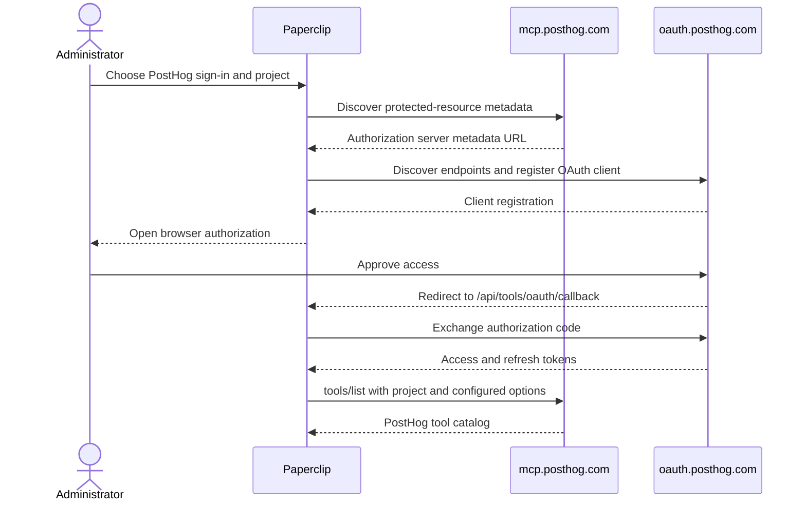

# PostHog connection

Paperclip connects to PostHog's hosted MCP service at
`https://mcp.posthog.com/mcp`. The connection supports two explicit methods:

- browser OAuth, which is recommended for hosted PostHog accounts; or
- a PostHog personal API key stored as a Paperclip secret and sent as an
  `Authorization: Bearer ...` header.

Paperclip does not silently fall back from OAuth to an API key. The selected
method is saved on the connection and reused for reconnects.

This curated connection is the polished route and is what most users should use:
it provides branding, project selection, read-only/feature/tool/mode controls,
field validation, and tailored guidance. None of it is *required* to reach
PostHog's MCP server. Since [PAP-17087](/PAP/issues/PAP-17087), PostHog can also
be connected generically from **Connect your own MCP server** by pasting
`https://mcp.posthog.com/mcp` — with a personal API key, with explicit headers, or
through browser sign-in — with no Paperclip-specific code involved. See
[Connecting any remote MCP server](./GENERIC-REMOTE-MCP.md).

## Service involvement

PostHog hosts both the MCP resource and OAuth authorization service. Paperclip
discovers the OAuth endpoints, dynamically registers the client when needed,
stores returned credentials as secret references, and handles the callback at
`/api/tools/oauth/callback`. No Paperclip-operated vendor relay is involved.

The current hosted endpoints are:

| Purpose | Endpoint |
| --- | --- |
| MCP resource | `https://mcp.posthog.com/mcp` |
| Protected-resource metadata | `https://mcp.posthog.com/.well-known/oauth-protected-resource/mcp` |
| Authorization-server metadata | `https://oauth.posthog.com/.well-known/oauth-authorization-server` |
| Authorize | `https://oauth.posthog.com/oauth/authorize/` |
| Token | `https://oauth.posthog.com/oauth/token/` |
| Dynamic client registration | `https://oauth.posthog.com/oauth/register/` |
| Revoke | `https://oauth.posthog.com/oauth/revoke/` |
| Paperclip callback | `/api/tools/oauth/callback` |

Redirect-URI constraints and token lifetimes remain provider-controlled and
must be rechecked during credentialed QA; Paperclip does not encode guessed
values for either.

## Administrator setup

1. In **Apps → Browse**, choose **PostHog**.
2. Explicitly choose **Sign in with PostHog** or **Use a personal API key**.
3. Enter the numeric PostHog project ID.
4. Leave **Read-only mode** off to expose the full PostHog action catalog.
   Turn it on when the connection should never offer actions that change data.
5. The default setup requests all feature groups and tools. Open **Advanced**
   only to narrow the catalog with **Feature groups** or **Individual tools**.
   Paperclip fixes the advanced response mode to individual tools so each
   action can be governed; CLI mode is unavailable until nested execution is
   governed.
6. For OAuth, continue through browser consent. For API-key setup, create a
   personal API key using PostHog's **MCP Server** preset and paste it into
   Paperclip. Never put the key in connection configuration or a URL.
7. Review discovered actions. Known writes ask first, destructive or nested
   execution tools remain quarantined, and unknown PostHog tools default to
   write risk until reviewed.

Paperclip sends the project scope as the `x-posthog-project-id` managed header.
It sends configured `readonly`, `features`, `tools`, and `mode` values as query
parameters. Leaving the optional feature and tool filters blank exposes the
full catalog. The managed header is identical during catalog discovery and tool
execution, and a caller cannot override it. PostHog documents these options in its [MCP
overview](https://posthog.com/docs/model-context-protocol) and [MCP
FAQ](https://posthog.com/docs/model-context-protocol/faq).

PostHog does not charge for MCP requests themselves, but the actions they
perform can consume normal PostHog usage or AI credits.
